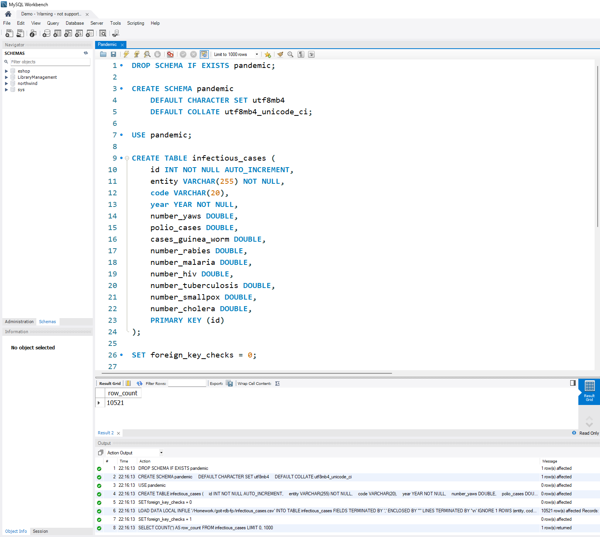
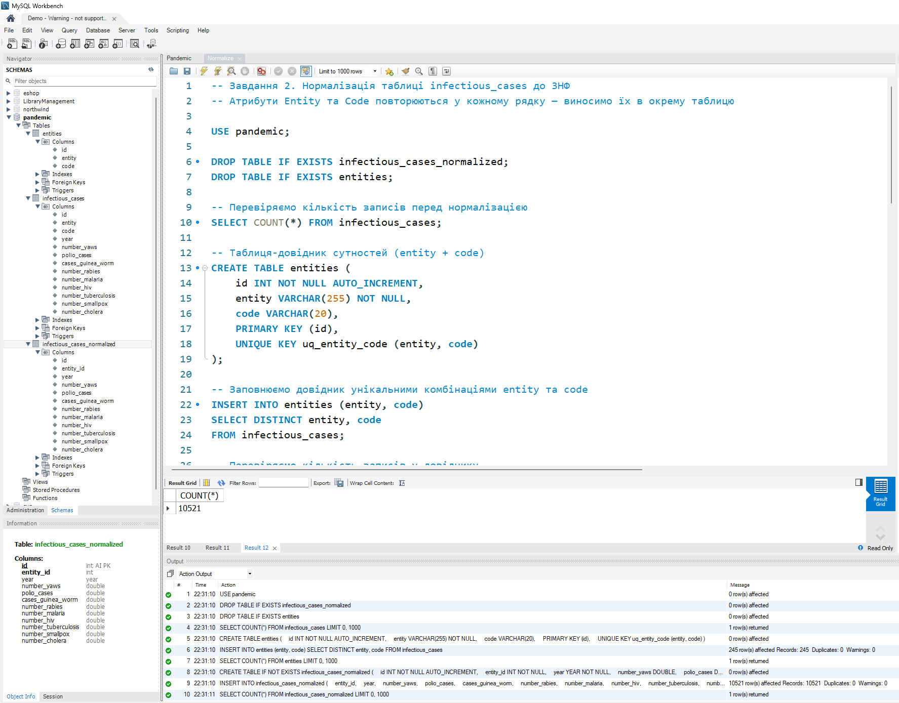
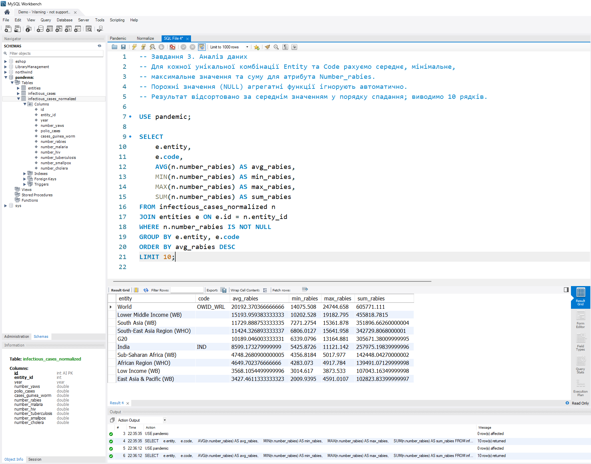
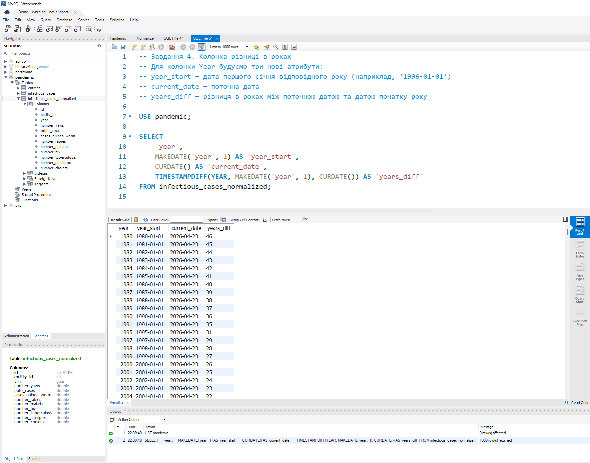
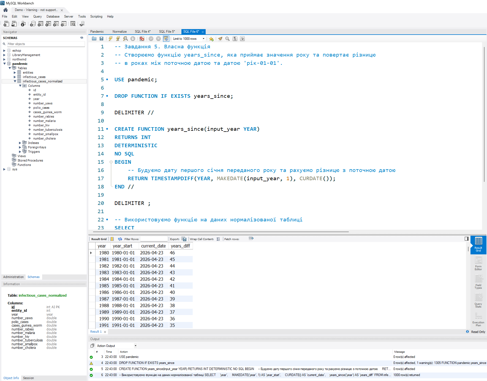

## Завдання 1

Створіть схему `pandemic` у базі даних, оберіть її як схему за замовчуванням та імпортуйте дані з файлу `infectious_cases.csv` за допомогою SQL-команди `LOAD DATA LOCAL INFILE`. \
Порожні значення у числових стовпцях замінюються на `NULL`.

```sql
DROP SCHEMA IF EXISTS pandemic;

CREATE SCHEMA pandemic
    DEFAULT CHARACTER SET utf8mb4
    DEFAULT COLLATE utf8mb4_unicode_ci;

USE pandemic;

CREATE TABLE infectious_cases (
    id INT NOT NULL AUTO_INCREMENT,
    entity VARCHAR(255) NOT NULL,
    code VARCHAR(20),
    year YEAR NOT NULL,
    number_yaws DOUBLE,
    polio_cases DOUBLE,
    cases_guinea_worm DOUBLE,
    number_rabies DOUBLE,
    number_malaria DOUBLE,
    number_hiv DOUBLE,
    number_tuberculosis DOUBLE,
    number_smallpox DOUBLE,
    number_cholera DOUBLE,
    PRIMARY KEY (id)
);

LOAD DATA LOCAL INFILE '/Homework/goit-rdb-fp/infectious_cases.csv'
INTO TABLE infectious_cases
FIELDS TERMINATED BY ',' ENCLOSED BY '"'
LINES TERMINATED BY '\n'
IGNORE 1 ROWS
(entity, code, year, @v1, @v2, @v3, @v4, @v5, @v6, @v7, @v8, @v9)
SET
    number_yaws         = NULLIF(@v1, ''),
    polio_cases         = NULLIF(@v2, ''),
    cases_guinea_worm   = NULLIF(@v3, ''),
    number_rabies       = NULLIF(@v4, ''),
    number_malaria      = NULLIF(@v5, ''),
    number_hiv          = NULLIF(@v6, ''),
    number_tuberculosis = NULLIF(@v7, ''),
    number_smallpox     = NULLIF(@v8, ''),
    number_cholera      = NULLIF(@v9, '');

SELECT COUNT(*) AS row_count FROM infectious_cases;
```



## Завдання 2

Нормалізуйте таблицю `infectious_cases` до 3-ї нормальної форми. \
Атрибути `Entity` та `Code` повторюються у кожному рядку — виносимо їх в окрему таблицю-довідник `entities`. \
Таблиця фактів `infectious_cases_normalized` посилається на `entities` через зовнішній ключ `entity_id`.

```sql
DROP TABLE IF EXISTS infectious_cases_normalized;
DROP TABLE IF EXISTS entities;

SELECT COUNT(*) FROM infectious_cases;

CREATE TABLE entities (
    id INT NOT NULL AUTO_INCREMENT,
    entity VARCHAR(255) NOT NULL,
    code VARCHAR(20),
    PRIMARY KEY (id),
    UNIQUE KEY uq_entity_code (entity, code)
);

INSERT INTO entities (entity, code)
SELECT DISTINCT entity, code
FROM infectious_cases;

SELECT COUNT(*) FROM entities;

CREATE TABLE IF NOT EXISTS infectious_cases_normalized (
    id INT NOT NULL AUTO_INCREMENT,
    entity_id INT NOT NULL,
    year YEAR NOT NULL,
    number_yaws DOUBLE,
    polio_cases DOUBLE,
    cases_guinea_worm DOUBLE,
    number_rabies DOUBLE,
    number_malaria DOUBLE,
    number_hiv DOUBLE,
    number_tuberculosis DOUBLE,
    number_smallpox DOUBLE,
    number_cholera DOUBLE,
    PRIMARY KEY (id),
    FOREIGN KEY (entity_id) REFERENCES entities(id)
);

INSERT INTO infectious_cases_normalized
(
    entity_id, year, number_yaws, polio_cases, cases_guinea_worm,
    number_rabies, number_malaria, number_hiv, number_tuberculosis,
    number_smallpox, number_cholera
)
SELECT
    e.id, ic.year, ic.number_yaws, ic.polio_cases, ic.cases_guinea_worm,
    ic.number_rabies, ic.number_malaria, ic.number_hiv, ic.number_tuberculosis,
    ic.number_smallpox, ic.number_cholera
FROM infectious_cases ic
JOIN entities e ON e.entity = ic.entity AND (e.code <=> ic.code);

SELECT COUNT(*) FROM infectious_cases_normalized;
```



## Завдання 3

Для кожної унікальної комбінації `Entity` та `Code` порахуйте середнє, мінімальне, максимальне значення та суму для атрибута `Number_rabies`. \
Рядки з порожнім значенням (`NULL`) відфільтровано. \
Результат відсортовано за середнім значенням у порядку спадання; виводиться 10 рядків.

```sql
SELECT
    e.entity,
    e.code,
    AVG(n.number_rabies) AS avg_rabies,
    MIN(n.number_rabies) AS min_rabies,
    MAX(n.number_rabies) AS max_rabies,
    SUM(n.number_rabies) AS sum_rabies
FROM infectious_cases_normalized n
JOIN entities e ON e.id = n.entity_id
WHERE n.number_rabies IS NOT NULL
GROUP BY e.entity, e.code
ORDER BY avg_rabies DESC
LIMIT 10;
```



## Завдання 4

Для колонки `Year` побудуйте три нові атрибути за допомогою вбудованих SQL-функцій:
- `year_start` — дата першого січня відповідного року (наприклад, `1996-01-01`),
- `current_date` — поточна дата,
- `years_diff` — різниця в роках між поточною датою та датою початку року.

```sql
SELECT
    `year`,
    MAKEDATE(`year`, 1) AS `year_start`,
    CURDATE() AS `current_date`,
    TIMESTAMPDIFF(YEAR, MAKEDATE(`year`, 1), CURDATE()) AS `years_diff`
FROM infectious_cases_normalized;
```



## Завдання 5

Створіть функцію `years_since`, яка приймає значення року та повертає різницю в роках між поточною датою та датою `{{рік}}-01-01`. \
Застосуйте функцію до даних нормалізованої таблиці.

```sql
DROP FUNCTION IF EXISTS years_since;

DELIMITER //

CREATE FUNCTION years_since(input_year YEAR)
RETURNS INT
DETERMINISTIC
NO SQL
BEGIN
    RETURN TIMESTAMPDIFF(YEAR, MAKEDATE(input_year, 1), CURDATE());
END //

DELIMITER ;

SELECT
    `year`,
    MAKEDATE(`year`, 1) AS `year_start`,
    CURDATE() AS `current_date`,
    years_since(`year`) AS `years_diff`
FROM infectious_cases_normalized;
```


